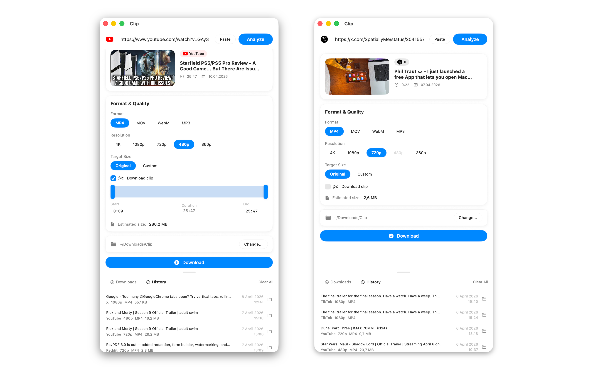

# Clip

A native macOS video downloader. Paste a link, pick your format, download.



## Features

- **Multi-platform** — YouTube, TikTok, Instagram, X (Twitter)
- **Format & quality** — MP4, MOV, WebM, MP3 / 4K to 360p
- **Clip extraction** — download just a portion of any video with a visual timecode bar
- **Target file size** — auto-compress to a custom MB limit via ffmpeg
- **Menu bar** — quick downloads from the menu bar with clipboard detection
- **Download queue** — concurrent downloads with progress, cancel, retry
- **History** — browse and re-download past videos with different settings
- **Auto-updates** — checks GitHub Releases on launch, one-click update

## Install

1. Download **Clip.dmg** from [Releases](../../releases/latest)
2. Open the DMG and either:
   - Drag **Clip.app** to Applications, or
   - Double-click **Install Clip.command** (recommended — handles Gatekeeper automatically)
3. If macOS says the app is damaged, open Terminal and run:
   ```
   xattr -cr /Applications/Clip.app
   ```

## Build from Source

```bash
# Prerequisites
brew install xcodegen

# Download binaries into Clip/Resources/bin/
mkdir -p Clip/Resources/bin
# yt-dlp: https://github.com/yt-dlp/yt-dlp/releases (yt-dlp_macos)
# ffmpeg + ffprobe: https://evermeet.cx/ffmpeg/ (static builds)

# Generate and build
xcodegen generate
xcodebuild -project Clip.xcodeproj -scheme Clip -configuration Debug build
```

## Update System

Clip checks GitHub Releases for updates on launch. To publish an update:

1. Bump `MARKETING_VERSION` in `project.yml`
2. Build and zip the app: `cd build/... && zip -r Clip.zip Clip.app`
3. Create a GitHub Release with tag `v1.x.x` and attach `Clip.zip`

Users get a banner in-app and can update with one click — no re-downloading DMGs.

## Tech Stack

- SwiftUI + AppKit (native macOS 14+)
- yt-dlp (video engine)
- ffmpeg/ffprobe (compression + probing)
- xcodegen (project generation)

## License

MIT
